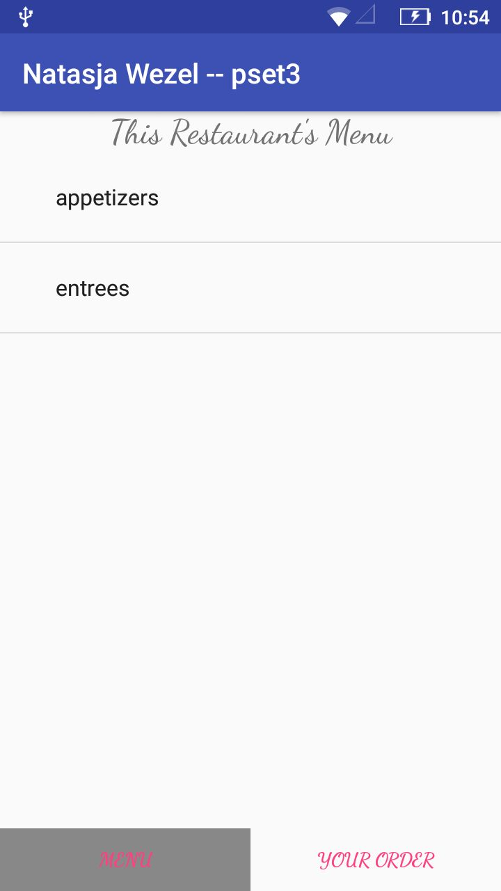
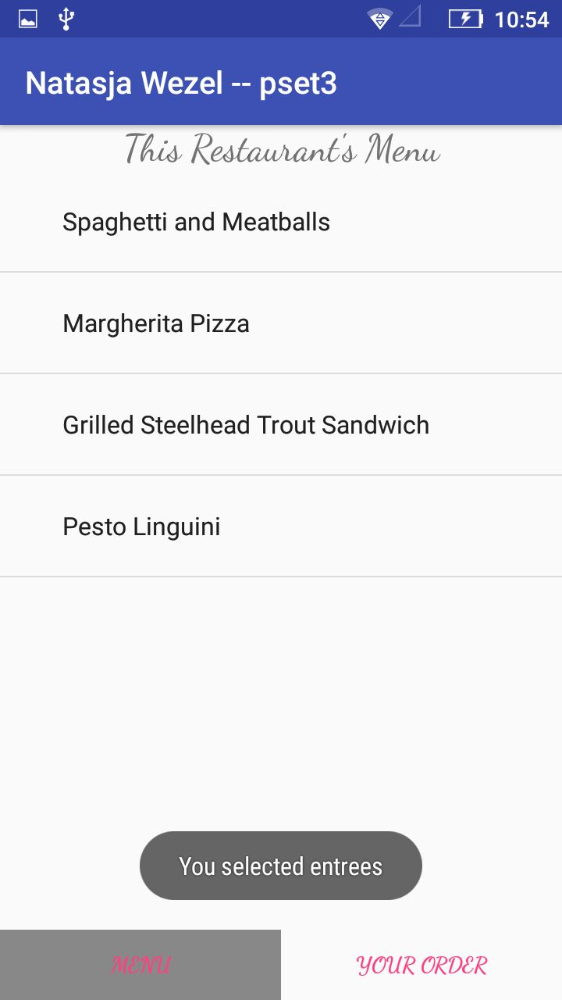
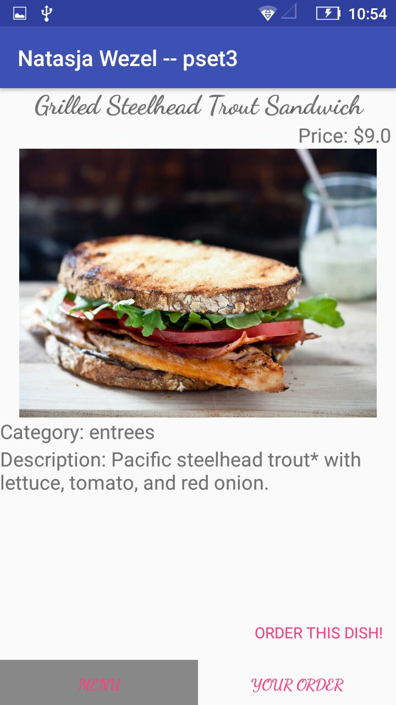
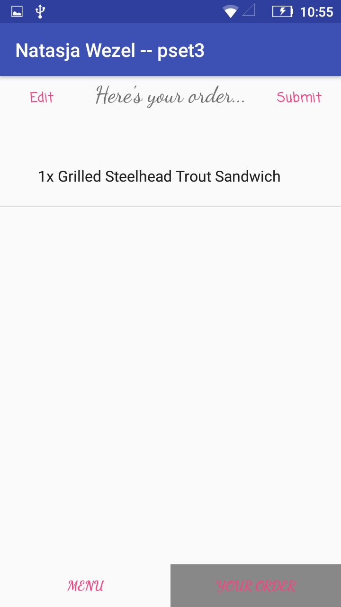
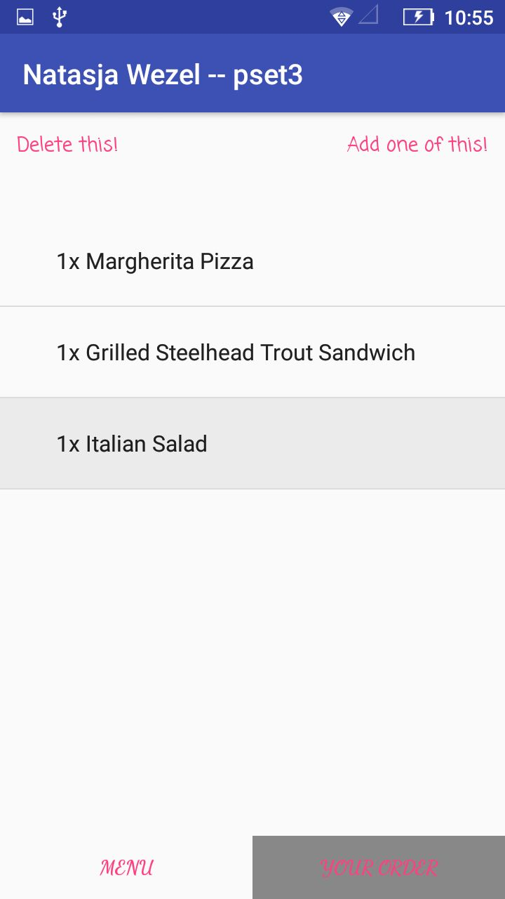
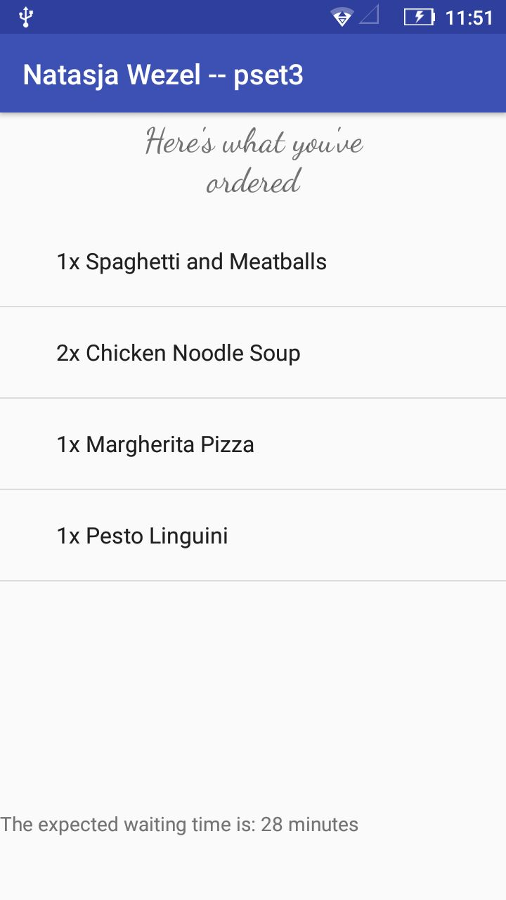
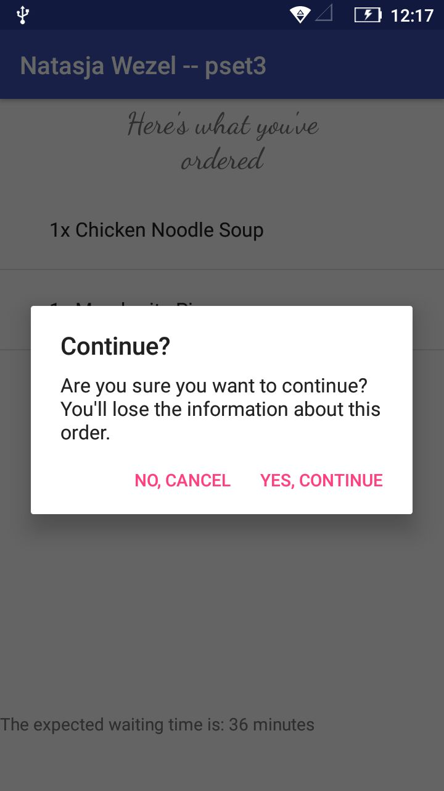

# NatasjaWezelpset3

Made by: Natasja Wezel
Minor Programmeren UvA: Native App Studio

This application allows a user to look through a menu of a Restaurant and add and remove dishes to their order. 
The menu of the API we use exists of two categories: entrees and appetizers.

If you pick one of those, you will see a list of the dishes in this category.

If you pick a dish, you'll be able to see it in more detail:

You can then click "Order this dish!" to order this dish. You will be redirected to this page:

Where you can see your order and edit how many of these dishes you want:

When you submit your order you willl be able to see how long it will take for the order to get served.

If you then click the back button to go back, an AlertDialog will pop up:
If you click yes, your order will be erased and you'll be redirected to the homepage. (to make another order?)

